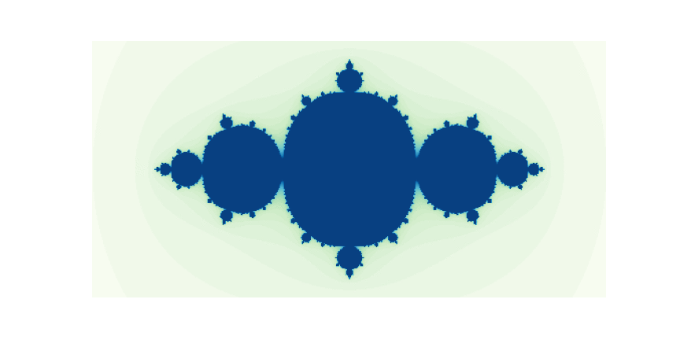

# Animations

Written in Python and visualized with Matplotlib and PyGame.
Inspired from math, science, algorithms and others.

### Brownian motion

### Analog signal modulations

### Fourier analysis of square pulse

### Quicksort

### Fractals: Mandelbrot and Julia sets

### Purple rain

### Metaballs

